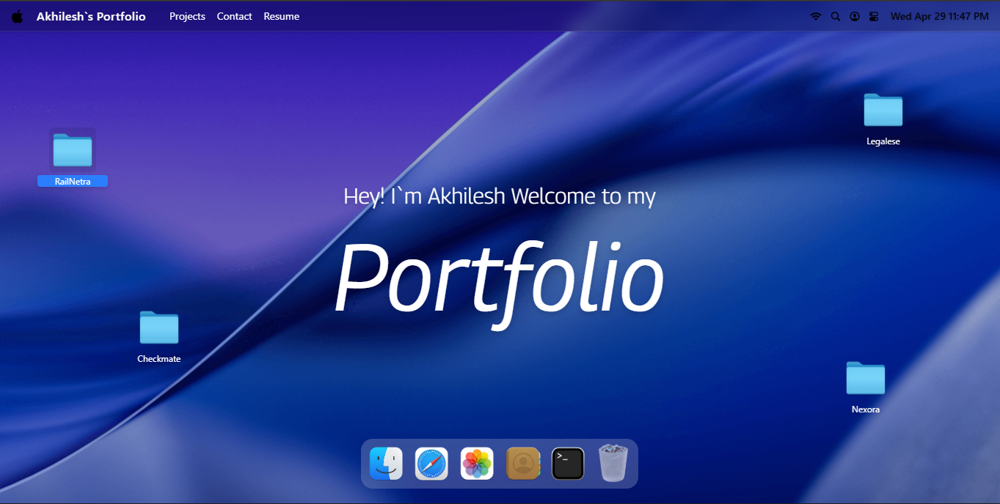

# 🚀 macOS Style Interactive Portfolio

An interactive developer portfolio that mimics a real macOS desktop experience.

Instead of a conventional scrollable website, this project lets users explore projects, open files, drag windows, and interact with UI elements — just like using an actual operating system.

---

## 🎬 Demo

[](https://drive.google.com/file/d/1dZH6AieP7_UU2OYOD8nPbVsOMCQ4-Fy1/view)

---

## 🌐 Live Website

**🔗 [https://akhilesh-sooty.vercel.app/](https://akhilesh-sooty.vercel.app/)**

---

## ✨ Features

- 🗂 **Finder-style Navigation** – Browse projects like folders
- 🖼 **Interactive Gallery** – Open and view images in draggable windows
- 📄 **Text-based About Section** – Styled like a macOS file preview
- 🖱 **Draggable Windows & Icons** – Realistic desktop interaction
- 🎨 **Dynamic Wallpapers** – Randomly changing backgrounds
- ⚡ **Smooth Animations** – Powered by GSAP
- 🧠 **State Management** – Handled with Zustand

---

## 🧰 Tech Stack

- **React** (with Vite)
- **Tailwind CSS**
- **GSAP** (Animations & Draggable)
- **Zustand** (State Management)

---

## 🖼️ Preview


---

## 🏗️ Project Structure

```bash
src/
├── components/
├── windows/
├── store/
├── constants/
├── hoc/

```

⚙️ Installation

```bash
git clone https://github.com/Parthakhil2901/your-repo.git
cd your-repo
npm install
npm run dev
```

🚀 Deployment
This project is deployed on Vercel.


🙌 Inspiration
Inspired by macOS user interface and the amazing work of Adrian Hajdin (JavaScript Mastery).


📬 Connect With Me

🌐 Portfolio: https://akhilesh-sooty.vercel.app/
💼 LinkedIn: https://linkedin.com/in/your-profile
💻 GitHub: https://github.com/Parthakhil2901


⭐ Support
If you enjoyed this project, feel free to give it a ⭐ on GitHub!

Made with ❤️ and a lot of macOS inspiration.
